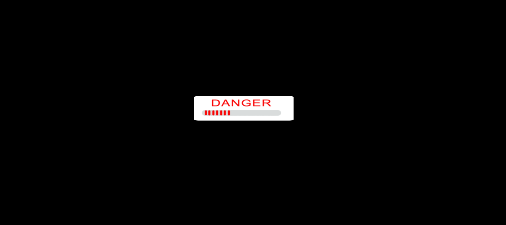

# GeeksHubs 

Proyecto 2 - TV con HTML, CSS Y JS

## Tabla de contenidos

- [Cómo funciona🕹️](#cómo-funciona)
- [Referencias📷](#referencias)
- [Desarrollo⛏️](#desarrollo)
- [Licencia y Copyright📃](#licencia-y-copyright)

### Cómo funciona

Nada más acceder encontramos un botón de presentación **DANGER** que al presionarlo nos llevará a la siguiente y principal sección de nuestra página, donde se mostrará la tv creada para el proyecto. 

 

La tv retro puede ejecutarse desde el navegador web y es capaz de realizar varias acciones: 

-Pulsando el boton grande, la tv iniciará y aparecerá un fondo de presentación. Además, esta acción provocará que el resto de los 6 botones superiores tengan funcionalidad y permita cambiar de canal al pulsarlos. Una vez que el botón de encendido vuelve a presionarse, todo el proceso anterior se revierte.

-Todos los botones cambiarán de aspecto al clicar sobre ellos.

### Referencias.

El modelo y todos los detalles que incluye este proyecto están basados en las televisiones antiguas y está inspirado en la película **The Ring**.

 

La televisión dispone de 7 botones: 1 para apagar y encender y los otros 6 restantes para poder cambiar por los diferentes canales.

El resultado con todos los elementos integrados es el siguiente:

### Desarrollo.

En el desarrollo de la televisión, se han empleado las siguientes tecnologías:

 HTML5 

 CSS3 

 JavaScript 

Se ha empleado la biblioteca Google Fonts:

 Google Fonts

También haremos uso de las siguientes herramientas:

 Visual Studio Code
  
 Git
     
GitHub

### Licencia y Copyright

Este proyecto pertenece a Ángel Díaz Calleja y ha sido creado como proyecto del Bootcamp Full Stack Developer de GeeksHubs Academy.

 
